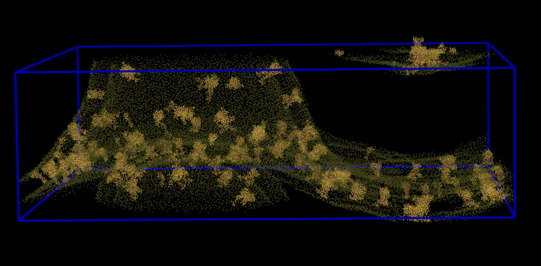
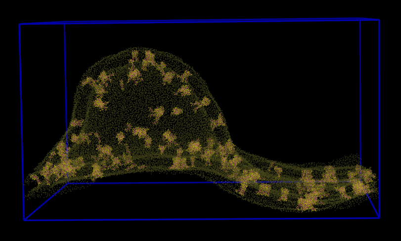

# pbc_fix

## Description

This script updates the coordinates of particles in molecular dynamics simulations in case the system simulated expanded or deformed so that it crossed the periodic boundaries of the unit cell along the z axis.

Before:



After:



## Installation

The script requires Python >= `3.7` and installation is via `pip`:

```bash
pip install pbc_fix
```
## Usage

Typical usage:

```bash
pbc_fix --topology top.gro --trajectory traj.xtc
```

Custom selection:

```bash
pbc_fix --topology top.gro --trajectory traj.xtc --selection "resname DPG1"
```

See all options:

```bash
pbc_fix --help
```

## How it works

The script simply compares the distance travelled by a particle along the z axis between consecutive frames. If this distance is greater than half the unit cell, the particle is considered to have crossed the box boundaries between the two frames processed (since it means the distance "via" the periodic boundary is shorter than the distance "within" the unit cell).

In practice this means that the script operates iteratively, frames can only be "fixed" by comparing them to previously fixed frames.

## Notes

1. The initial reference frame should be a "clean" frame, i.e. a frame where the particles of interest haven't yet crossed over the unit cell z boundary.

2. By default the first frame of the trajectory is used as the initial reference frame. The coordinates of the topology file can be used instead by using the `--ref-topology` flag. This is most likely useful several successive trajectory files need fixing: the last "fixed" frame of trajectory `n` can be used as the initial reference frame for trajectory `n+1`.

3. The time resolution of the trajectory file should be high enough that it remains possible to distinguish a pbc "jump" from "natural" travel of a particle along the z axis - i.e. the time delta between frames should not allow particles to naturally travel more than half the unit cell along the z axis.

4. The particles of interest are controlled via the `--selection` parameter and should probably not include any solvent particles, since by nature these will "naturally" cross the unit cell boundaries. Note that the fixed trajectory will only contain the selected particles so it is more efficient to pre-process the trajectory to extract these to reduce the size of the files to process.

5. The `--buffer` parameter ensures that the minimum distance (along the z axis) between the lowest and highest particles in the unit cell will always be > buffer, even with pbc.

6. Coordinates in the output files are translated such that the particles are centered in the unit cell. 

## Contributing

Please report bugs or enhancement requests through the [Issue Tracker](https://github.com/jhelie/pbc_fix/issues).

Pull requests welcome. Just create a new Python environment, for instance via:

```bash
conda -n pbc_fix_dev python=3.7
conda activate pbc_fix_dev
``` 

And install the dev requirements:

```bash
pip install -r requirements.txt
```

Please make sure you use the `yapf` formatter with the `.style.yapf` file in this repository.

## Citation

If you use this script in published work please reference this repository or cite [this thesis](https://ora.ox.ac.uk/objects/uuid:1f154de5-6073-4bc6-986a-397734f5f140).
